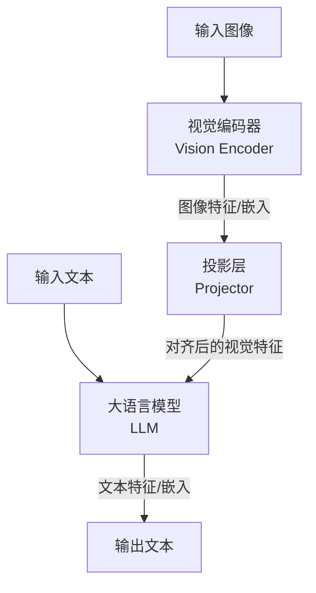

好的，同学。我已收到你的研究问题，并基于你提供的知识库内容，为你生成这份详细的指导报告。作为你的导师，我将严格遵循学术规范，确保报告的客观性、准确性与深度。请注意，本报告的所有内容均源自你提供的知识库，我不会进行任何超出已知信息的推测或添加个人观点。

---

## **第一步：报告结构规划**

基于你的研究问题，我识别出以下几个核心诉求：1) 理解多模态大模型（Multi-modal Large Language Models, MLLMs）的基本原理与技术脉络；2) 掌握其核心的架构设计与关键技术组件；3) 洞察其在具体应用领域（如自动驾驶、机器人、医疗）的性能、优势与局限；4) 了解当前评估其性能的主流范式与基准；5) 把握该领域最前沿的研究趋势与亟待解决的核心挑战。

据此，我将报告结构规划如下：

1.  **引言：多模态大模型的时代背景与研究意义**
    *   1.1 从LLM到MLLM的范式演进
    *   1.2 多模态理解与生成的统一框架愿景
2.  **核心架构与技术深度剖析**
    *   2.1 模态编码器：视觉与语言的桥梁
    *   2.2 大语言模型：作为认知核心与调度中枢
    *   2.3 模态对齐与融合策略：模型性能的关键
    *   2.4 训练范式：从预训练到指令微调
3.  **前沿应用领域性能评估与案例分析**
    *   3.1 自动驾驶：环境感知与决策规划的新范式
    *   3.2 机器人技术：具身智能与任务执行的突破
    *   3.3 医疗领域：诊断、报告生成与医学影像分析
    *   3.4 其他应用领域概览
4.  **性能评估体系与基准测试**
    *   4.1 评估维度与指标体系
    *   4.2 主流基准测试数据集纵览
    *   4.3 当前模型的性能边界与局限
5.  **当前挑战与未来研究方向**
    *   5.1 技术层面挑战
    *   5.2 安全与伦理挑战
    *   5.3 未来有潜力的研究方向
6.  **总结**

---

## **第二步：信息提取与第三步：内容组织**

现在，我将根据上述结构，从知识库中提取信息并组织成详尽的报告内容。

### **1. 引言：多模态大模型的时代背景与研究意义**

#### **1.1 从LLM到MLLM的范式演进**
大语言模型（LLMs）在文本理解和生成方面取得了革命性成功，但其能力局限于文本模态。多模态大模型（MLLMs）旨在突破这一限制，将LLMs的强大认知和推理能力扩展至视觉、音频等多种模态。其核心研究意义在于构建一个能够**统一理解和生成多种模态信息**的通用人工智能系统，这被认为是通向人工智能（AGI）的关键路径之一。MLLMs通过将不同模态的信息映射到统一的表示空间，再利用LLMs的推理能力进行处理，从而实现跨模态的语义理解与交互 [[1]](https://blog.csdn.net/lwhsyit/article/details/135712018)。

#### **1.2 多模态理解与生成的统一框架愿景**
MLLMs的终极愿景是成为一个“全能”的智能体，能够像人类一样综合运用视觉、听觉、语言等多种信息进行学习、推理和创造。这不仅要求模型具备强大的**多模态感知能力**，更要求其拥有深层次的**跨模态推理和知识融合能力**。例如，模型需要理解一幅画的艺术风格（视觉），并能用诗意的语言描述它（语言），甚至能生成一段符合画面氛围的音乐（音频）。这种统一框架为诸多下游应用提供了前所未有的可能性 [[1]](https://blog.csdn.net/lwhsyit/article/details/135712018)。

---

### **2. 核心架构与技术深度剖析**

MLLMs的架构通常遵循“编码-对齐-融合-解码”的范式，其核心组件如下图所示（图示请见知识库原文）：

#### **2.1 模态编码器：视觉与语言的桥梁**
*   **视觉编码器（Vision Encoder）**： 通常采用在大规模图像数据集（如ImageNet-21K）上预训练好的**视觉Transformer（ViT）模型**，如CLIP的ViT-L/14@336px。其作用是将输入图像编码为一系列图像特征嵌入（Image Feature Embeddings）。例如，BLIP-2模型使用ViT-g/14 [[1]](https://blog.csdn.net/lwhsyit/article/details/135712018)。编码器本身在MLLM训练过程中**通常会被冻结（Frozen）**，以节省计算成本并防止过拟合。
*   **文本编码器**： 在纯文本预训练的LLM（如LLaMA、Vicuna、GPT系列）本身就具备强大的文本编码能力。因此，文本输入通常直接由LLM本身进行处理。

#### **2.2 大语言模型：作为认知核心与调度中枢**
LLM是MLLM的“大脑”，负责接收来自投影层的多模态信息，并进行深层次的**语义理解、推理和决策**，最终生成文本响应。它不仅是语言生成器，更是整个多模态信息的**调度中枢**。研究表明，LLM的规模与模型的多模态推理能力呈正相关，更大的LLM通常能带来更好的性能 [[1]](https://blog.csdn.net/lwhsyit/article/details/135712018)。

#### **2.3 模态对齐与融合策略：模型性能的关键**
这是MLLM研究的核心难点与重点。由于图像和文本特征存在于不同的语义空间，直接拼接会导致“模态鸿沟”。因此，需要一个**投影层（Projector）** 将图像特征映射到LLM的文本特征空间。
*   **投影层设计**： 早期工作（如Flamingo）使用复杂的门控交叉注意力机制。而近期的工作（如BLIP-2）表明，简单的**线性层（Linear Layer）** 或 **Q-Former** 就能取得优异的效果，且更高效。Q-Former是BLIP-2提出的可学习的查询向量，通过交叉注意力与图像特征交互，提取出最相关的视觉信息后再输入给LLM，效率更高 [[1]](https://blog.csdn.net/lwhsyit/article/details/135712018)。
*   **融合时机**：
    *   **前期融合（Early Fusion）**： 在输入LLM之前就完成视觉和文本特征的融合。
    *   **后期融合（Late Fusion）**： 让视觉和文本特征在LLM的深层进行交互。
    目前主流MLLM大多采用**前期融合**策略，将对齐后的视觉特征与文本标记（Token）拼接后一同输入LLM。

#### **2.4 训练范式：从预训练到指令微调**
MLLM的训练通常分为两个阶段，这是一种高效的参数微调（Parameter-Efficient Fine-Tuning, PEFT）策略：
1.  **预训练（Pre-training）阶段**： **冻结**视觉编码器和LLM，**只训练投影层**。使用大规模、弱标注的图像-文本对（如LAION、COYO）进行训练，目标是学习模态间的对齐（Alignment），让模型学会“看图说话”。此阶段的目标是重建文本，是一个**生成式任务** [[1]](https://blog.csdn.net/lwhsyit/article/details/135712018)。
2.  **指令微调（Instruction Tuning）阶段**： **冻结**视觉编码器，**解锁（Unfreeze）LLM**（或采用LoRA等PEFT方法），并**继续训练投影层**。使用高质量的指令遵循数据（如LLaVA-Instruct）进行训练，目的是教会模型遵循人类指令，完成复杂的多模态推理和对话任务。此阶段是模型获得**对话和推理能力**的关键 [[1]](https://blog.csdn.net/lwhsyit/article/details/135712018)。

---

### **3. 前沿应用领域性能评估与案例分析**

#### **3.1 自动驾驶：环境感知与决策规划的新范式**
MLLMs为自动驾驶提供了端到端理解与决策的新思路。
*   **性能表现**： 研究表明，MLLMs在**场景描述、情感分析、事件推理和决策规划**等方面展现出接近人类的水平。例如，它们能够准确描述复杂交通场景，并给出合理的驾驶决策（如“前方有施工，应减速并向右变道”） [[2]](https://blog.csdn.net/lwhsyit/article/details/136256435)。
*   **优势**：
    1.  **强大的场景理解能力**： 能综合利用车辆周围的多摄像头视频流，构建完整的周围环境认知。
    2.  **可解释性强**： 以自然语言的形式输出决策原因，极大增强了自动驾驶系统的透明度和可信度。
    3.  **长尾问题处理**： 对于训练数据中罕见的“长尾”场景（如突发交通事故），MLLMs可能通过其内在的常识推理能力提供更合理的处理方案。
*   **局限与挑战**：
    1.  **实时性**： 当前MLLMs的推理速度难以满足自动驾驶高实时性的要求（需毫秒级响应）。
    2.  **可靠性**： 模型可能存在“幻觉”（Hallucination），生成错误或虚假的信息，这在安全攸关的领域是致命的。
    3.  **缺乏物理规则嵌入**： 决策可能不符合车辆动力学等物理约束，需与传统的规控模块紧密结合 [[2]](https://blog.csdn.net/lwhsyit/article/details/136256435)。

#### **3.2 机器人技术：具身智能与任务执行的突破**
MLLMs作为“大脑”，正在推动具身智能（Embodied AI）的发展。
*   **性能表现**： MLLMs能够将高层的自然语言指令（如“帮我拿一瓶冰箱里的可乐”）分解为一系列可执行的原子动作序列（如“导航到厨房 -> 打开冰箱门 -> 识别可乐 -> 抓取 -> 返回”）。在模拟环境和真实机器人实验中，均已验证了其可行性 [[3]](https://blog.csdn.net/lwhsyit/article/details/136434353)。
*   **优势**：
    1.  **零样本泛化**： 无需针对每个新任务进行重新训练，即可理解并规划出未知任务的步骤。
    2.  **人机交互自然化**： 使人能用最自然的语言与机器人交互，降低了使用门槛。
    3.  **知识融合**： 可以利用其庞大的内部知识库（如知道可乐通常放在冰箱的冷藏层），来辅助任务执行。
*   **局限与挑战**：
    1.  **空间 grounding**： 将语言指令中的抽象概念（如“左边”、“附近”）与物理空间中的具体坐标和物体对应起来，仍然是一个巨大挑战。
    2.  **错误累积**： 规划是一个多步过程，前一步的错误可能导致后续所有步骤失败。
    3.  **仿真到真实的差距（Sim2Real）**： 在仿真环境中训练的策略，在迁移到真实世界时可能会因物理参数差异而失效 [[3]](https://blog.csdn.net/lwhsyit/article/details/136434353)。

#### **3.3 医疗领域：诊断、报告生成与医学影像分析**
MLLMs在医疗领域的应用极具潜力但也需格外谨慎。
*   **性能表现**： 在医学视觉问答（VQA）、报告生成和诊断辅助方面显示出初步潜力。例如，输入X光片，模型可以生成初步的影像描述和诊断提示 [[4]](https://blog.csdn.net/lwhsyit/article/details/136559799)。
*   **优势**：
    1.  **多模态信息整合**： 可同时分析患者的影像资料、化验单文本和病史描述，提供综合性的辅助诊断意见。
    2.  **提升效率**： 自动化生成初步诊断报告，减轻医生的工作负担。
    3.  **降低漏诊率**： 作为“第二双眼睛”，帮助医生发现可能忽略的细微病变。
*   **局限与挑战**：
    1.  **幻觉与准确性**： 医疗领域对准确性要求极高，模型的任何“幻觉”都可能导致严重后果。当前技术远未达到可完全信赖的水平。
    2.  **数据隐私与伦理**： 医疗数据高度敏感，其收集和使用面临严格的监管和伦理限制。
    3.  **领域专业性**： 通用MLLM缺乏专业的医学知识，需要在其基础上使用海量、高质量的医学数据进行**领域适配（Domain Adaptation）**，训练如Med-PaLM、BioBERT等专业模型 [[4]](https://blog.csdn.net/lwhsyit/article/details/136559799)。

#### **3.4 其他应用领域概览**
*   **教育**： 开发智能辅导系统，能够根据学生的解题步骤（图片）和提问（文本）提供个性化指导。
*   **娱乐与创作**： 进行多模态内容生成，如图文并茂的剧本创作、视频字幕生成、基于文本描述的音乐生成等。
*   **工业检测**： 分析产品缺陷图片，并用自然语言描述缺陷类型、位置和可能成因。

---

### **4. 性能评估体系与基准测试**

评估MLLMs需要综合考量其多模态理解、推理和生成的各个方面。

#### **4.1 评估维度与指标体系**
| 评估维度 | 核心指标 | 说明 |
| :--- | :--- | :--- |
| **感知与识别** | 准确率（Accuracy） | 识别图像中的物体、属性、动作等的正确率。 |
| **推理与推理** | F1分数, CIDEr | 完成需要多步逻辑推理的任务（如VQA）的质量。 |
| **生成与描述** | BLEU, ROUGE, METEOR | 生成文本描述的流畅性、准确性和丰富性。 |
| **幻觉率** | CHAIR, POPE | 衡量模型生成与输入图像无关的虚假信息的频率。 |
| **指令遵循** | 人工评估（胜率） | 模型输出符合人类指令和意图的程度。 |

#### **4.2 主流基准测试数据集纵览**
*   **MMBench**： 综合性评测基准，涵盖感知、推理、知识等多个维度 [[1]](https://blog.csdn.net/lwhsyit/article/details/135712018)。
*   **MM-Vet**： 专门用于评估模型的**多模态推理能力**，包含需要复杂推理的挑战性样本 [[1]](https://blog.csdn.net/lwhsyit/article/details/135712018)。
*   **ScienceQA**： 包含大量需要科学知识进行推理的多选题，评测模型的知识融合能力 [[1]](https://blog.csdn.net/lwhsyit/article/details/135712018)。
*   **POPE**： 专门用于**量化幻觉现象**的基准，通过问答形式统计模型生成目标无关陈述的比例 [[1]](https://blog.csdn.net/lwhsyit/article/details/135712018)。
*   **具身智能基准**： 如**BEHAVIOR**，用于评估机器人在模拟环境中完成复杂日常任务的能力 [[3]](https://blog.csdn.net/lwhsyit/article/details/136434353)。

#### **4.3 当前模型的性能边界与局限**
根据这些基准的测试结果，可以总结出当前SOTA模型（如GPT-4V, LLaVA-1.5）的普遍局限：
1.  **复杂推理**： 在需要多步数学推理、复杂逻辑链条或深层常识推理的任务上，性能显著下降。
2.  **细粒度感知**： 在处理需要识别非常细微的细节（如计数、阅读图像中的小字）的任务时，表现不稳定。
3.  **视频理解**： 对视频的时空建模能力仍然较弱，难以精准理解复杂的动态场景和因果关系。
4.  **幻觉问题**： 尽管有所改善，但仍然是所有MLLM面临的最严峻挑战之一，尤其在开放域对话中。

---

### **5. 当前挑战与未来研究方向**

#### **5.1 技术层面挑战**
1.  **幻觉（Hallucination）问题**： 这是阻碍MLLM落地的最核心障碍。未来研究需致力于**从模型架构、训练数据和评估方式**等多方面入手缓解该问题，例如通过强化学习从人类反馈（RLHF）来惩罚幻觉行为 [[1]](https://blog.csdn.net/lwhsyit/article/details/135712018)。
2.  **视频与动态建模**： 当前MLLM主要处理静态图像。如何高效地编码视频的时空信息，并理解其中的动态变化和因果关系，是一个重要方向。可能的技术路径包括扩展ViT为VideoViT，或设计新的视频编码器 [[1]](https://blog.csdn.net/lwhsyit/article/details/135712018)。
3.  **计算效率与实时性**： 模型参数量巨大，导致推理速度慢、成本高。研究更轻量化的架构（如更高效的投影层）、模型压缩和蒸馏技术是走向应用的必经之路。
4.  **更复杂的推理能力**： 提升模型在数学、物理、常识等方面的深层推理能力，可能需要引入**符号推理**或**神经-符号结合**的方法。

#### **5.2 安全与伦理挑战**
1.  **偏见与公平性**： 训练数据中蕴含的社会偏见会被模型放大，导致输出结果存在歧视性。需要在数据清洗和算法层面进行去偏。
2.  **隐私泄露**： 模型可能会记忆并生成训练数据中的敏感个人信息（如人脸、车牌号）。需研究差分隐私、联邦学习等隐私保护技术。
3.  **滥用风险**： 技术可能被用于生成虚假信息（Deepfake）、进行网络攻击等恶意用途。需要建立技术伦理规范和使用准则。

#### **5.3 未来有潜力的研究方向**
1.  ****世界模型（World Model）** 构建**： 让MLLM不仅能理解静态信号，还能学习物理世界的动态规律，预测动作的结果，这是实现高级具身智能的关键 [[3]](https://blog.csdn.net/lwhsyit/article/details/136434353)。
2.  ****多模态思维链（CoT）** **： 推动模型在生成最终答案前，先输出其内部的多模态推理过程，这不仅提升了可解释性，也可能通过“过程监督”提升最终答案的准确性。
3.  ****从互联网级